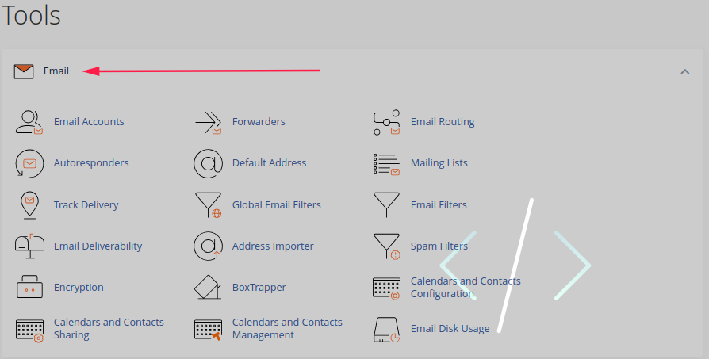
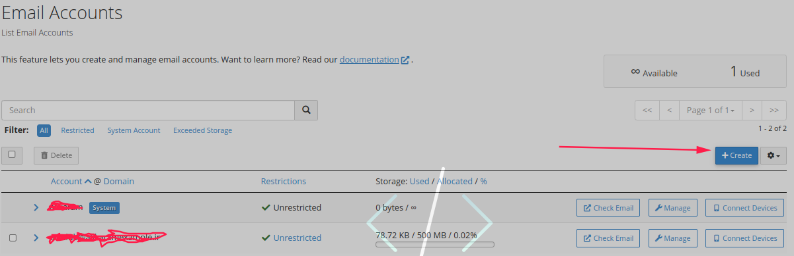
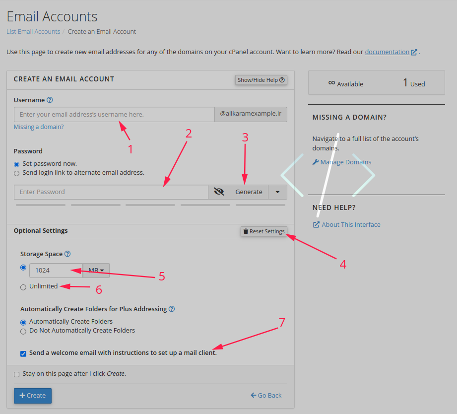
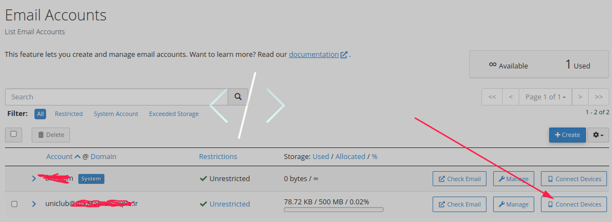
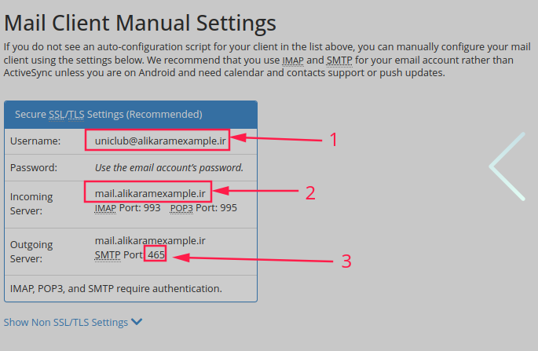
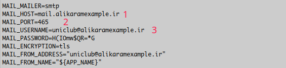

# send-email-on-host-by-laravel

### ارسال کردن ایمیل به کاربران توسط لاراول در هاست اشتراکی

#### Email Accounts

رفتن به بخش ساخت ایمیل جدید هست بعد

| Number | Description                                                                                          | Example                           |
| ------ | ---------------------------------------------------------------------------------------------------- | --------------------------------- |
| 1      | ساخت یک ایمیل تجاری که بخش اول آن اسمی دلخواه و بعد از اتساین اسم دامین را قرار مدهیم                | sample@domain, uniclub@alikara.ir |
| 2      | در اینجا یک رمز بسیار قدرتمند که امنیت این اکانت مارا تضیمن کند                                      |                                   |
| 3      | با زدن روی این دکمه یک رمز قدرتمند برای ما میسازد                                                    | Generate                          |
| 4      | با زدن روی این دکمه ما میتوانیم تنظیمات بیشتری روی این اکانتمون اعمال کنیم                           |                                   |
| 5      | میزان حجمی که میخواهیم ایمیل در ان ذخیره شود                                                         |                                   |
| 6      | با زدن این تیک ما نامحدود در نظر گرفتیم حجمو و به اندازه رم ما جا میگیره هرچقدر فضا خالی داشت        |                                   |
| 7      | تعیین میکنیم ایمیل خوش امد گویی برای این ایمیل مار ارسال بکند یا نه بعد از ساخته شدن این ایمیل تجاری |                                   |

### Connect to laravel

بعد از انجام دادن این کار ها ما میتوانیم که ایمیل مورد نظر را به پروژه لاراولی خود وصل کنیم

| Number | Description                                                                                          | Example                           |
| ------ | ---------------------------------------------------------------------------------------------------- | --------------------------------- |
| 1      | نام کاربری که ساختیم در اینجا قرار دارد                | sample@domain, uniclub@alikara.ir |
| 2      | در اینجا یک رمز بسیار قدرتمند که امنیت این اکانت مارا تضیمن کند                                      |                                   |
| 3      | با زدن روی این دکمه یک رمز قدرتمند برای ما میسازد                                                    | Generate                          |

